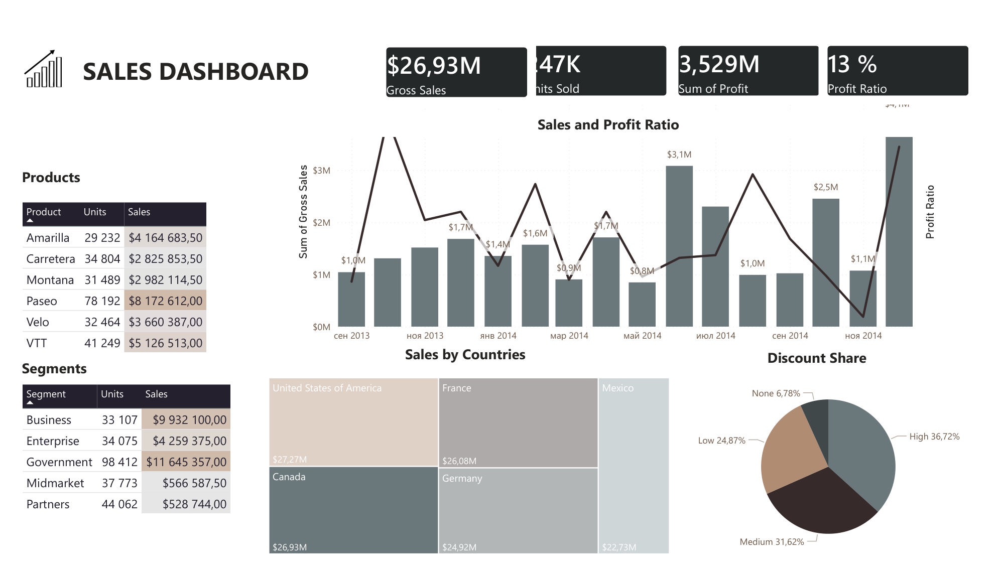

# 📊 Дашборд продажів у Power BI — Аналіз рентабельності

> **Власний проєкт | Аналітика даних | Power BI**

Інтерактивний дашборд продажів, створений у **Microsoft Power BI Desktop** для аналізу показників продажів, рентабельності, товарів, сегментів клієнтів, географії продажів та частки знижок.

---

## 🎯 Бізнес-завдання

Бізнесу потрібен зручний інструмент для відстеження ефективності продажів і рентабельності з різних аналітичних ракурсів.

Дашборд об’єднує ключові показники в одному візуальному звіті та дозволяє користувачеві аналізувати:

- загальні показники продажів;
- рентабельність;
- ефективність окремих товарів;
- сегменти клієнтів;
- продажі в розрізі країн;
- динаміку продажів у часі;
- розподіл знижок.

Проєкт демонструє, як аналітичну інформацію можна перетворити на компактний бізнес-дашборд.

---

## 📌 Ключові показники (KPI)

Дашборд містить чотири основні показники KPI:

| KPI | Значення |
|---|---:|
| **Продано одиниць** | **247 тис.** |
| **Валові продажі** | **$26,93 млн** |
| **Прибуток** | **$3,529 млн** |
| **Рентабельність** | **13%** |

---

## 📈 Попередній перегляд дашборду



---

## 🔎 Що відображає дашборд

### 1. Продажі та рентабельність

Дашборд містить візуалізацію динаміки продажів і рівня рентабельності за звітний період.

Це дозволяє користувачеві відстежувати зміни в обсягах продажів і прибутковості з плином часу.

### 2. Аналіз товарів

Таблиця товарів містить дані про кількість проданих одиниць та обсяги продажів для таких позицій:

- Amarilla
- Carretera
- Montana
- Paseo
- Velo
- VTT

Таким чином, дашборд можна використовувати для порівняння ефективності продажів окремих товарів.

### 3. Аналіз сегментів клієнтів

Звіт відображає дані про продажі та кількість проданих одиниць для таких сегментів клієнтів:

- Business (Бізнес)
- Enterprise (Великий бізнес)
- Government (Державний сектор)
- Midmarket (Середній бізнес)
- Partners (Партнери)

Це дозволяє порівняти внесок різних сегментів клієнтів у загальний обсяг продажів. 

### 4. Аналіз за країнами

Дашборд відображає інформацію про продажі для таких країн:

- Сполучені Штати Америки
- Канада
- Франція
- Німеччина
- Мексика

### 5. Частка знижок

Дашборд містить розподіл за часткою знижок (за категоріями):

- Висока
- Середня
- Низька
- Відсутня

Це забезпечує додатковий ракурс для аналізу взаємозв'язку між знижками та показниками продажів.

---

## 💡 Аналітичний фокус

Проєкт зосереджений на відповідях на практичні бізнес-питання, зокрема:

- Який загальний обсяг продажів?
- Який загальний прибуток і коефіцієнт прибутковості?
- Які товари забезпечують найбільші обсяги продажів?
- Як розподіляються продажі між сегментами клієнтів?
- Як відрізняються показники продажів у різних країнах?
- Як змінюються продажі та коефіцієнт прибутковості з часом?
- Як розподіляється частка знижок?

Ці питання розкриваються безпосередньо через картки KPI, таблиці та візуалізації на дашборді.

---

## 🛠️ Інструменти та навички

### Інструменти

- **Microsoft Power BI Desktop**

### Навички аналізу даних та BI

- Розробка KPI
- Створення бізнес-дашбордів
- Візуалізація даних
- Аналіз продажів
- Аналіз прибутковості
- Аналіз товарів
- Аналіз сегментів клієнтів
- Аналіз у розрізі країн
- Візуалізація часових рядів
- Дизайн інтерактивних звітів

---

## 📂 Структура репозиторію

```text
power-bi-profit-ratio/
│
├── Profit Ratio.pbix
├── Profit Ratio.pdf
├── README.md
├── .gitignore
│
└── images/
└── dashboard.png
```

### Файли

| Файл | Опис |
|---|---|
| `Profit Ratio.pbix` | Оригінальний проєкт Power BI Desktop |
| `Profit Ratio.pdf` | PDF-експорт дашборду |
| `README.md` | Документація проєкту |
| `images/dashboard.png` | Зображення попереднього перегляду дашборду |
| `.gitignore` | Конфігурація ігнорування файлів для Git | ---

## 📊 Розділи дашборду

Звіт містить такі аналітичні компоненти:

**Картки KPI**
- Продані одиниці товару
- Валовий обсяг продажів
- Прибуток
- Рентабельність (коефіцієнт прибутковості)

**Візуальний аналіз**
- Динаміка продажів і рентабельності
- Продажі за продуктами
- Продажі за сегментами клієнтів
- Продажі за країнами
- Частка знижок

---

## 🚀 Мета проєкту

Цей проєкт було створено як **власний проєкт для портфоліо**, щоб продемонструвати практичний досвід роботи з Power BI та навички візуалізації даних, орієнтованої на бізнес-потреби.

Основна увага приділяється не лише створенню окремих діаграм, а й об’єднанню різних аналітичних представлень в єдиний дашборд, придатний для бізнес-аналізу.

---

## 📷 Дашборд

Дашборд створено в **Power BI Desktop** та експортовано у формат PDF для презентації.

---

## 👩‍💻 Авторка

**Тетяна Кійко**

Аналітика даних / Проєкт для портфоліо (Power BI)